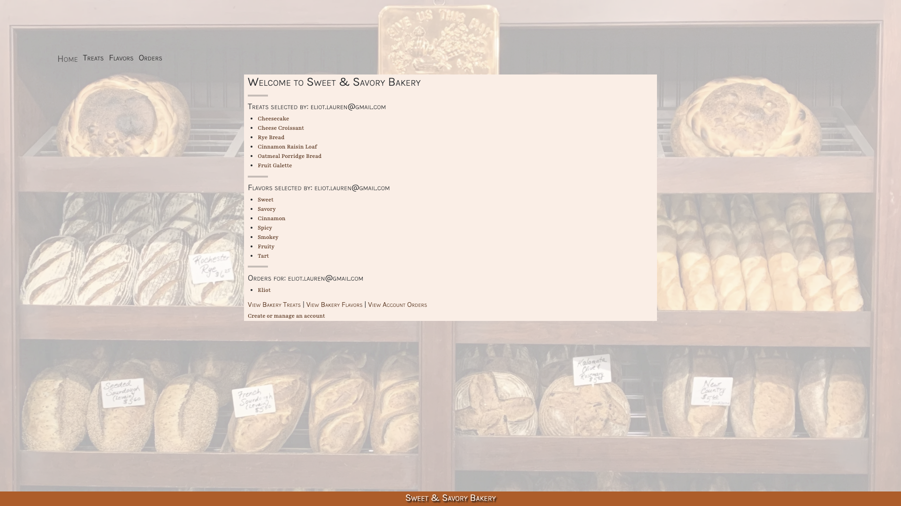

# 🥖 _Sweet & Savory Bakery Treats_ 🥖

#### By Eliot Gronstal 3.24.23



#### _A Mvc application to market sweet and savory treats for a bakery application with user authentication and many-to-many relationships._

## Technologies Used

* 🍩 _C#_
* 🍩 _.NET 6_
* 🍩 _CSS_
* 🍩 _HTML_
* 🍩 _Bootstrap_
* 🍩 _ASP.NET Core MVC_
* 🍩 _MySQL_
* 🍩 _SQL Workbench_
* 🍩 _Entity Framework_
* 🍩 _Identity Framework_
* 🍩 _VS Code_

## Description

_A Mcv application to market sweet and savory treats with user authentication and a many-to-many relationships._ 

_Here are the features in the application:_

* 🍴 The application has user authentication. A user can log in and log out. Only logged in users have create, update, and delete functionality. All users have read functionality.

* 🍴 There is a many-to-many relationship between `Treats` and `Flavors`. 

* 🍴 A treat can have many flavors (such as sweet, savory, spicy, or creamy) and a flavor can have many treats. For example, the "sweet" flavor can include objects such as chocolate croissants, cheesecake, etc.

* 🍴 A user can navigate to a splash page that lists all treats and flavors. A user can click on an individual treat or flavor to see all the treats/flavors that belong to it.

## Setup/Installation Requirements

* 🥐 _Clone this repo._
* 🥐 _Open your terminal (e.g., Terminal or GitBash) and navigate to this project's production directory called "Bakery"._
* 🥐 _In the command line, run the command ``dotnet run`` to compile and execute the console application. Since this is a console application, you'll interact with it through text commands in your terminal._
* 🥐 _Optionally, you can run ``dotnet build`` to compile this console app without running it._
* 🥐 _This program was built using `Microsoft .NET SDK 6.0`, and may not be compatible with other versions._

* 🥐 _If you want to run the project in production mode with a watcher, you can use a command line flag to specify that you want to run the "production" profile. ``dotnet watch run --launch-profile "production"``_
*  🥐 _Open the browser to [https://localhost:5001]. If you cannot access localhost:5001 it is likely because you have not configured a .NET developer security certificate for HTTPS. To learn about this, review this lesson: [Redirecting to HTTPS and Issuing a Security Certificate.](https://www.learnhowtoprogram.com/c-and-net/basic-web-applications/redirecting-to-https-and-issuing-a-security-certificate)_

## SQL Workbench Configuration
* 🥖 _Create an `appsetting.json` file in the "Bakery" directory of the project._
* 🥖 _Within `appsettings.json`, put in the following code, replacing the `uid` and `pwd` values with your own username and password for MySQL._ 
```json
{
    "ConnectionStrings": {
        "DefaultConnection": "Server=localhost;Port=3306;database=[PROJECT-NAME];uid=[YOUR-USERNAME-HERE];pwd=[YOUR-PASSWORD-HERE];"
    }
}
```
* 🥖 _If you'd like to push this cloned project to a public-facing repository, remember to add the appsettings.json file to your .gitignore first._
* 🥖 _Once "appsettings.json" file has been created, navigate back to SQL Workbench._ 
* 🥖 _Import the database named ``"bakery.sql"`` from the root directory of the project._ 

## Database Import Instructions

* 🍩 _Open SQL workbench._
* 🍩 _Navigate to the "Administration" tab in SQL Workbench._
* 🍩 _Click ``"Data Import/Restore"``_
* 🍩 _Select the radio button "Import from Self-Contained File" and include file path to the sql file of this project that has been cloned to your machine._
* 🍩 _In "Default Schema to be Imported to" click "New"._
* 🍩 _Name the schema ``"bakery"`` then click "OK"._
* 🍩 _Once named, switch to ``"Import Progress"`` tab and click ``"Start Import"``._

## Known Bugs

* 🍴 _No known bugs_

* 🍴 _Please reach out with any questions or concerns to [eliot.lauren@gmail.com](eliot.lauren@gmail.com)_

## License

_[MIT](https://opensource.org/license/mit/)_

Copyright (c) _2023_ _Eliot Gronstal_